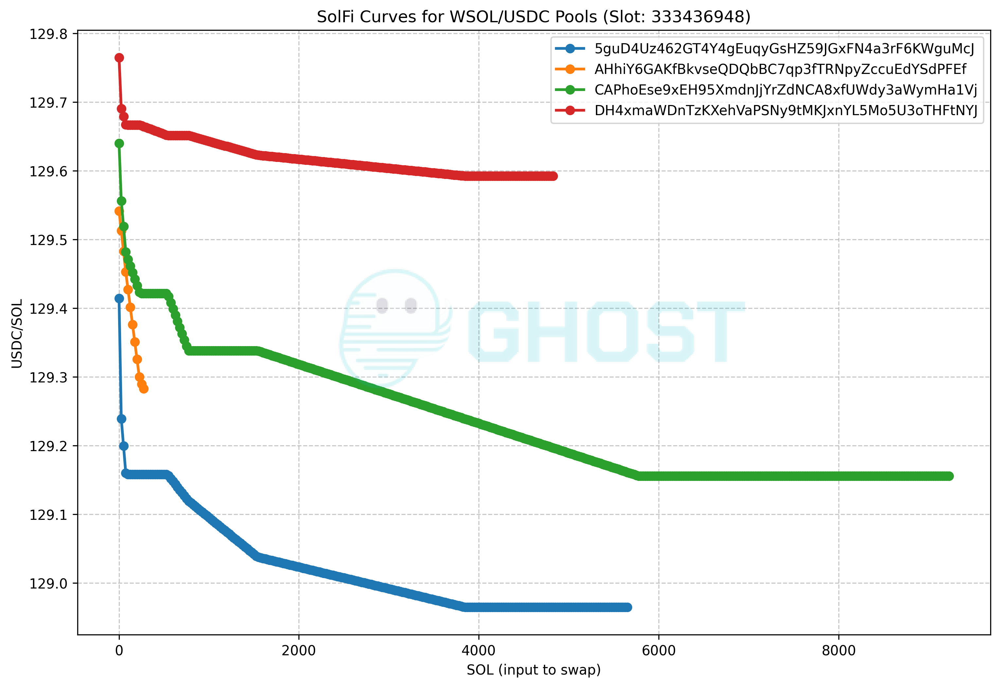

## SolFi Simulator

We were curious how [SolFi](https://solscan.io/account/SoLFiHG9TfgtdUXUjWAxi3LtvYuFyDLVhBWxdMZxyCe) worked, so I built
a very simple simulator.

`solfi-sim` uses [LiteSVM](https://github.com/LiteSVM/litesvm) to run transactions against 4 WSOL/USDC pairs locally and
in-memory. I've included the state of those accounts at slot `333456106` and this simulator also includes a way to
re-fetch

Why not just run simulations against an RPC node? You could but if you want to understand the full curve you'll need to
make hundreds of requests. It's more efficient and fun to play around with the states locally, and this is a good
starting point. And more importantly, if you run against an RPC node, you can't guarantee that your requests will all run against the same slot.
These SolFi pools appear to update every slot, and running against the fetched state in a local SVM provides better simulation guarantees there.

### Build

```shell
cargo build --release
```

### Usage

```shell
./target/release/solfi-sim
Usage: solfi-sim <COMMAND>

Commands:
  fetch-accounts  Fetch the solfi wsol/usdc pool accounts and related data
  cutoffs         Print slot cutoff and other metadata from fetched solfi pool data
  simulate        Simulate a WSOL -> USDC swap in all the solfi wsol/usdc pools
  help            Print this message or the help of the given subcommand(s)

Options:
  -h, --help     Print help
  -V, --version  Print version
```

Check the locally persisted account states against which we run our sims

```shell
$ ./target/release/solfi-sim cutoffs
== fetched between slots 333456106 and 333456107 ==
5guD4Uz462GT4Y4gEuqyGsHZ59JGxFN4a3rF6KWguMcJ cutoff slot=333456306, generated slot=333456106
DH4xmaWDnTzKXehVaPSNy9tMKJxnYL5Mo5U3oTHFtNYJ cutoff slot=333456306, generated slot=333456106
AHhiY6GAKfBkvseQDQbBC7qp3fTRNpyZccuEdYSdPFEf cutoff slot=333456306, generated slot=333456106
CAPhoEse9xEH95XmdnJjYrZdNCA8xfUWdy3aWymHa1Vj cutoff slot=333456306, generated slot=333456106
```

Simulate a swap of 10 SOL -> USDC

```shell
$ ./target/release/solfi-sim simulate --amount 10
5guD4Uz462GT4Y4gEuqyGsHZ59JGxFN4a3rF6KWguMcJ,10.0,1296.914489,
DH4xmaWDnTzKXehVaPSNy9tMKJxnYL5Mo5U3oTHFtNYJ,10.0,1296.876372,
AHhiY6GAKfBkvseQDQbBC7qp3fTRNpyZccuEdYSdPFEf,10.0,1296.753182,
CAPhoEse9xEH95XmdnJjYrZdNCA8xfUWdy3aWymHa1Vj,10.0,1296.7628789999999,
```

You can also simulate across a range of liquidity:

```shell
seq 10 10 10000 | xargs -P 8 -I {} ./target/release/solfi-sim simulate --ignore-errors --amount {} > data_333456106.csv 
```

You can use your favorite charting tool to plot the curves. Here's an example:



You can fetch the latest account states from the chain:

```shell
cp .env.sample .env
## OPTIONALLY ADD A SOLANA RPC ENDPOINT to your .env

./target/release/solfi-sim fetch-accounts
./target/release/solfi-sim cutoffs
```

## Disclaimer

*This code is being provided as is. No guarantee, representation or warranty is being made, express or implied, as to
the safety or correctness of the code. It has not been audited and as such there can be no assurance it will work as
intended, and users may experience delays, failures, errors, omissions or loss of transmitted information. Nothing in
this repo should be construed as investment advice or legal advice for any particular facts or circumstances and is not
meant to replace competent counsel. It is strongly advised for you to contact a reputable attorney in your jurisdiction
for any questions or concerns with respect thereto. Author is not liable for any use of the foregoing, and users should
proceed with caution and use at their own risk.*

